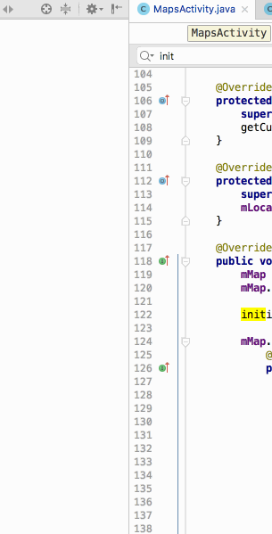

# roadbull_android

**Roadbull** is a basic Google Map application for routing from current location to multiples destinations.

Time spent: **8** hours spent in total

## User Stories

The following **required** functionality is completed:

- [x] Pin some addresses (5 addresses) on Google Map.
- [x] Show route from your current location to selected pin on the map.
- [x] Show the popup when you click on pin similar to right picture.

## Video Walkthrough

Here's a walkthrough of implemented user stories:

GIF created with [LiceCap](http://www.cockos.com/licecap/).

## Notes

This is an pre-interview assignment from [Roadbull Logistics Pre Ltd](https://www.roadbull.com/)

## License

Copyright [2018] [Tri Ngo Minh]

Licensed under the Apache License, Version 2.0 (the "License");
you may not use this file except in compliance with the License.
You may obtain a copy of the License at

http://www.apache.org/licenses/LICENSE-2.0

Unless required by applicable law or agreed to in writing, software
distributed under the License is distributed on an "AS IS" BASIS,
WITHOUT WARRANTIES OR CONDITIONS OF ANY KIND, either express or implied.
See the License for the specific language governing permissions and
limitations under the License.